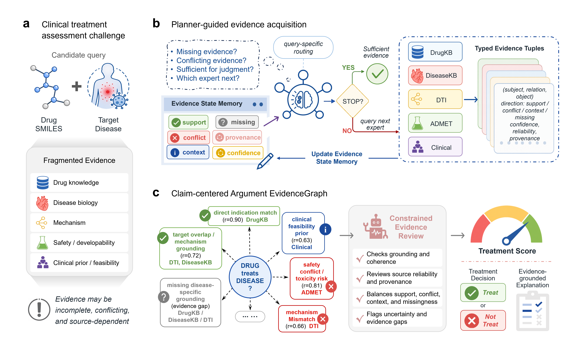

# TreatAgent

TreatAgent is an evidence-guided multi-agent system for prioritizing drug
repurposing candidates. Given a drug represented by SMILES and a disease name,
TreatAgent gathers complementary biomedical evidence, organizes it into a
structured evidence graph, and returns a calibrated treatment-potential score
with an auditable explanation.

The repository contains the runnable TreatAgent implementation, benchmark
splits, local expert knowledge indexes, model assets, analysis scripts, and
tests used for the accompanying manuscript.

## Workflow

<p align="center">
  
</p>

TreatAgent evaluates each drug-disease pair through five local expert modules:

- DiseaseKB expert: disease targets, pathways, mechanisms, and therapeutic priors.
- DrugKB expert: drug indications, known targets, mechanisms, and prior use.
- ADMET expert: molecular property and developability signals.
- DTI expert: drug-target interaction estimates using the included local model.
- Clinical expert: disease-level clinical success prior.

The orchestrator selects evidence sources, stores typed evidence in an evidence
graph, computes argument-level features, and produces a final probability and
binary prediction. Optional report generation writes an interactive HTML
summary for each case.

## Repository Contents

- `treatagent/`: core package, CLI, orchestration, experts, reporting, and memory.
- `data/benchmark/`: benchmark records, splits, and CLI-ready split inputs.
- `data/drugcentral/drugkb.jsonl`: DrugKB runtime index.
- `data/diseasekb/diseasekb.jsonl`: DiseaseKB runtime index.
- `data/clinical/disease_success_ratio.json`: clinical prior used by the local Clinical expert.
- `data/dti/uniprot_sequence_cache.json`: UniProt sequence cache used by the DTI expert.
- `assets/models/model_MPNN_CNN/`: local DeepPurpose DTI model.
- `assets/templates/report_template.html`: HTML report template.
- `experiments/`: model scoring, calibration, ablation, and analysis utilities.
- `scripts/`: curated analysis, baseline, argument-scorer, and evidence-graph experiment entry points.
- `tests/`: lightweight unit tests for orchestration and scoring utilities.

Large runtime files are tracked with Git LFS. After cloning, run `git lfs pull`
if the large files were not downloaded automatically.

## Installation

Clone the repository with Git LFS enabled:

```bash
git lfs install
git clone https://github.com/xinyaolai9-oss/TreatAgent-code.git
cd TreatAgent-code
git lfs pull
```

Create the recommended Conda environment:

```bash
conda env create -f environment.yml
conda activate treatagent
```

Alternatively, install with pip in an existing Python 3.10 environment:

```bash
pip install -r requirements.txt
```

## Input Format

TreatAgent reads a JSON list of drug-disease records. Each record should include
at least `smiles` and `disease`; benchmark files also include labels and drug
metadata.

```json
[
  {
    "smiles": "CC(=O)OC1=CC=CC=C1C(=O)O",
    "disease": "colorectal cancer",
    "label": 1,
    "drug_names": ["aspirin"]
  }
]
```

Ready-to-run benchmark inputs are available under
`data/benchmark/split_inputs/`, including:

- `drug_disjoint_test.json`
- `random_test.json`
- `temporal_test.json`
- `temporal_submit_test.json`

## Quick Start

Run the default evidence-graph TreatAgent path on the drug-disjoint test split:

```bash
python -m treatagent.cli \
  --json_path data/benchmark/split_inputs/drug_disjoint_test.json \
  --method multiagent \
  --agent_version eg \
  --backbone local
```

Generate per-case HTML reports:

```bash
python -m treatagent.cli \
  --json_path data/benchmark/split_inputs/drug_disjoint_test.json \
  --method multiagent \
  --agent_version eg \
  --backbone local \
  --generate_report
```

Resume an interrupted run:

```bash
python -m treatagent.cli \
  --json_path data/benchmark/split_inputs/drug_disjoint_test.json \
  --method multiagent \
  --agent_version eg \
  --backbone local \
  --resume
```

Enable vector-memory retrieval and storage:

```bash
python -m treatagent.cli \
  --json_path data/benchmark/split_inputs/drug_disjoint_test.json \
  --method multiagent \
  --agent_version eg \
  --backbone local \
  --use_memory
```

## Running LLM-Augmented Modes

The default `eg` configuration can run with local experts and the evidence-graph
scorer. LLM-augmented settings are available through `agent_version=full` or
`agent_version=ls` when an API endpoint is configured.

```bash
export URL_VALUE="https://your-api-endpoint"
export API_VALUE="your-api-key"

python -m treatagent.cli \
  --json_path data/benchmark/split_inputs/drug_disjoint_test.json \
  --method multiagent \
  --agent_version full \
  --backbone gpt-4o
```

On PowerShell:

```powershell
$env:URL_VALUE = "https://your-api-endpoint"
$env:API_VALUE = "your-api-key"
```

Supported multi-agent versions:

- `eg`: evidence graph with argument-level scoring.
- `full`: LLM-assisted planner/judge path when API access is available.
- `ls`: LLM synthesis scorer baseline when API access is available.

The `direct`, `cot`, and `rag` baselines are also available through `--method`.

## Outputs

Batch runs write timestamped JSON files to:

```text
results/<backbone>/results_<method>_<agent_version>_<timestamp>.json
```

Result records may include:

- `prediction_binary`
- `raw_score`
- `calibrated_probability`
- `argument_probability`
- `final_score_source`
- `synthesis_explanation`
- `trajectory`
- `evidence_graph`
- `expert_outputs`
- `report_path`
- `memory_similar_cases`

Additional runtime directories:

- `reports/`: generated HTML reports when `--generate_report` is used.
- `checkpoints/`: resumable checkpoints.
- `memory_db/`: ChromaDB vector store when `--use_memory` is used.

## Benchmark And Analysis Utilities

Benchmark construction scripts are under `data/benchmark/scripts/`:

```bash
bash data/benchmark/scripts/run_benchmark_pipeline.sh
```

Knowledge-index builders are included with their corresponding data folders:

```bash
python data/drugcentral/build_drugkb_jsonl.py
python data/diseasekb/build_diseasekb_jsonl.py
```

Experiment and analysis utilities are organized under:

- `experiments/orchestration/`: scoring, calibration, and ablation utilities.
- `scripts/eg/`: evidence-graph TreatAgent experiment and scorer runners.
- `scripts/arg/`: argument-scorer training and ablation runners.
- `scripts/baselines/`: RAG and raw-feature baseline runners.
- `scripts/analysis/`: final-result summaries and publication-figure rendering.

## Testing

Run the lightweight test suite from the repository root:

```bash
python -m pytest tests
```

## Citation

Citation metadata is provided in `CITATION.cff`. If you use TreatAgent, cite the
archived software release and the associated manuscript when available.

## License

See `LICENSE`.

## Acknowledgements

- [Clinical Trial Outcome Prediction](https://github.com/futianfan/clinical-trial-outcome-prediction/)
- [DeepPurpose](https://github.com/kexinhuang12345/DeepPurpose)
- [ADMET-AI](https://github.com/swansonk14/admet_ai)
- [ChEMBL](https://github.com/chembl/chembl_webresource_client)
